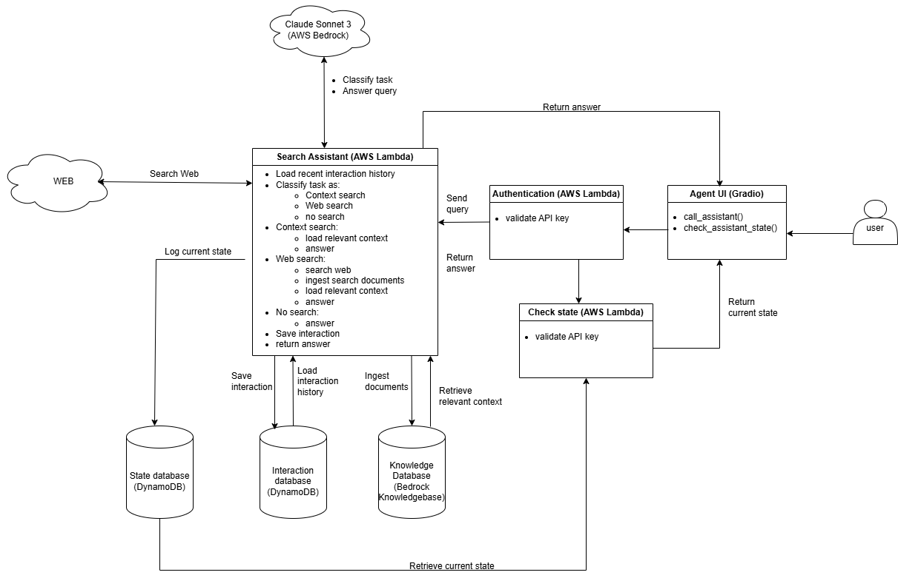

# Web Search Assistant

The Web Search Assistant is an AI agent that answers user queries by retrieving relevant information from the web.

## Table of Contents

  - [Repository Contents](#Repository-contents)
  - [Search Assistant current architecture](#Search-Assistant-current-architecture)
  - [Detailed Search Assistant description](#detailed-Search-Assistant-description)
  - [Tech-stack](#Tech-stack)
  - [Search Assistant API](#Search-Assistant-API)
  - [Deployment Strategy](#Deployment-Strategy)

## Repository contents

  - `\src` contains the Search Assistant source code.
  - `\notebooks` contains jupyter notebooks used for testing the assistant's functionalities.
  - `\resources` contains various resources such as figures or custom AWS Lambda Layers.

## Search Assistant current architecture

## Search Assistant detailed description

The Search Assistant is an AI agent that answers user queries by retrieving relevant information from the web.
  - Upon receiving a new user query, the assistant loads most-recent K user interactions from a database;
  - Based on the query and the past interactions, the assistant uses an LLM to decide whether web search, knowledge base search or no search are required to answer the query.
  - If web search is needed:
    - the LLM converts the query to a web query
    - the assistant uses `DuckDuckGo`to search the web for relevant information
    - retrieved PDF and HTML are parsed, chunked and ingested into a vector database
    - the query is augmented with the most-relevant L entries from the vector database
    - the LLM answers the query from the retrieved context information
  - If knowledge base search is needed (the query continues the topic of previous interactions):
    - the query is augmented with the most-relevant L entries from the vector database
    - the LLM answers the query from the retrieved context information
  - If no information is needed (e.g. common knowledge questions the LLM knows how to answer):
    - the LLM answers the query
  - Finally:
    - the assistant saves the new interaction to memory
    - the assistant returns the answer
  
  **Note**: In every step, the assistant logs its current state to a database that can be queried by the user to check the assistant's current state.

  The assistant high-level flow is implemented in `src\orchestrator.py`.
  The assistant API is implemented in `src\assistant_api.py`.
  The GUI to interact with the assitant is implemented in `gradio_ui.py`.
   
## Tech Stack

  - the search assistant is implemented as an `AWS Lambda` function accessible through an `AWS API Gateway`
  - calls to the `API Gateway` are first routed to a `Lambda Authorizer` function that validates a secret API key stored in `AWS Secrets Manager`
  - the assistant is implemented in `Python 3.12`
  - past user interactions are stored in a `DynamoDB` database
  - the assistant state is logged to a `DynamoDB` database
  - documents retrieved from the web are ingested into an `Amazon Knowledge Base` vector database
  - web searches are done with the `DuckDuckGo` browser
  - `claude sonnet 3` is used for query classification and answering
  - the user can interact with the assistant through a `Gradio` GUI

## Search Assistant API

The Search Assistant API is composed of two functions, defined in `src\assistant_api.py`:
- `call_assistant` queries the assistant
- `check_assistant_state` retrieves the current state of the assistant

A GUI is implemented in `src\gradio_ui.py` to facilitate user interaction with the assistant. It can be launched by executing the script from the command line (`python <path_to_script>\gradio_ui.py`)

