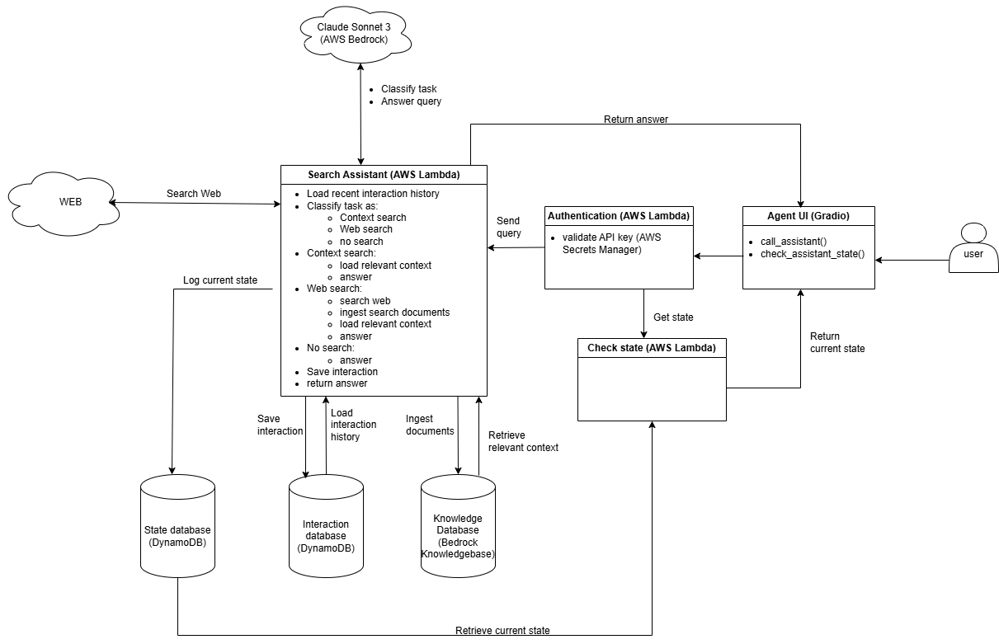

# Web Search Assistant

The Web Search Assistant is an AI agent that answers user queries by retrieving relevant information from the web.

## Table of Contents

  - [Repository Contents](#Repository-contents)
  - [Search Assistant current architecture](#Search-Assistant-current-architecture)
  - [Detailed Search Assistant description](#detailed-Search-Assistant-description)
  - [Tech-stack](#Tech-stack)
  - [Search Assistant API](#Search-Assistant-API)
  - [Deployment Strategy](#Deployment-Strategy)

## Repository contents

  - `\src\assistant_core` contains the Search Assistant source code.
  - `\src\assistant_api` contains the Search Assitant API
  - `\src\assistant_ui` contains the Search Assistant GUI
  - `\src` contains AWS Lambda handlers and authenticators
  - `\notebooks` contains jupyter notebooks used for testing the assistant's functionalities.
  - `\resources` contains various resources such as figures or custom AWS Lambda Layers.
  - `\task4` contains the solution of task 4
  - `\task5` contains the solution of task 5
  - `\task6` contains the solution of task 6

## Search Assistant current architecture

## Search Assistant detailed description

The Search Assistant is an AI agent that answers user queries by retrieving relevant information from the web.
  - Upon receiving a new user query, the assistant loads most-recent K user interactions from a database;
  - Based on the query and the past interactions, the assistant uses an LLM to decide whether web search, knowledge base search or no search are required to answer the query.
  - If web search is needed:
    - the LLM converts the query to a web query
    - the assistant uses `DuckDuckGo` to search the web for relevant information
    - retrieved PDF and HTML are parsed, chunked and ingested into a vector database
    - the query is augmented with the most-relevant L entries from the vector database
    - the LLM answers the query from the retrieved context information
  - If knowledge base search is needed (the query continues the topic of previous interactions):
    - the query is augmented with the most-relevant L entries from the vector database
    - the LLM answers the query from the retrieved context information
  - If no information is needed (e.g. common knowledge questions the LLM knows how to answer):
    - the LLM answers the query
  - Finally:
    - the assistant saves the new interaction to memory
    - the assistant returns the answer
  - A GUI is provided to facilitate the interaction of users with the assistant. The GUI also allows users to provide feedback per answer through "thumps-up" and "thumbs-down" buttons, although this feedback is not yet stored or processed.
  
  **Note**: In every step, the assistant logs its current state to a database that can be queried by the user to check the assistant's current state.

  The assistant high-level flow is implemented in `src\orchestrator.py`.
  The assistant API is implemented in `src\assistant_api.py`.
  The GUI to interact with the assitant is implemented in `gradio_ui.py`.
   
## Tech Stack

  - the search assistant is implemented as an `AWS Lambda` function accessible through an `AWS API Gateway`
  - calls to the `API Gateway` are first routed to a `Lambda Authorizer` function that validates a secret API key stored in `AWS Secrets Manager`
  - the assistant is implemented in `Python 3.12`
  - past user interactions are stored in a `DynamoDB` database
  - the assistant state is logged to a `DynamoDB` database
  - documents retrieved from the web are ingested into an `Amazon Knowledge Base` vector database
  - web searches are done with the `DuckDuckGo` browser
  - `claude sonnet 3` is used for query classification and answering
  - the user can interact with the assistant through a `Gradio` GUI

## Search Assistant API

The Search Assistant API is composed of two functions, defined in `src\assistant_api.py`:
- `call_assistant` queries the assistant
- `check_assistant_state` retrieves the current state of the assistant

A GUI is implemented in `src\gradio_ui.py` to facilitate user interaction with the assistant. It can be launched by executing the script from the command line (`python <path_to_script>\gradio_ui.py`).

**Note**: The only necessary step prior to interacting with the assistant is obtaining the secret API Key and storting it as a local environment variable called "ISA_API_KEY".

## Deployment Strategy

Many architectural aspects of the Web Search Asistant are already defined (see [Search Assistant current architecture](#Search-Assistant-current-architecture)). However, the current architecture has certain limitations or gaps, which are addressed here.

  - Deployment of updates to the Search Assistant needs to be automated. A deployment pipeline can be implemented for instance with `GitHub Actions` or `AWS CodePipeline`.
  - Scalability: The assistant currently runs as an AWS Lambda function, so it can scale to potentially thousands of concurrent requests and can be used worldwide. However, AWS API Gateways are hardcoded to time out after 30 seconds, meaning the current architecture is not suitable for difficult time-consuming requests. To circumvent this, the assistant should be migrated to AWS Step Functions or deployed as a containerized application (using `docker`) to a `kubernetes` cluster.
  - Reliability:
    - performance metrics must be tracked. This includes latency, user feedback on response quality, error codes, etc. `AWS Cloudwatch` can be used for this purpose. Examples of metrics to track:
      - latency per component (e.g. interaction database queries, LLM calls, etc.)
      - explicit user feedback (thumbs up/down)
      - implicit user feedback (time spent reading answer, click-through rate, follow-up questions, clarifying questions, conversation drop-off, etc.)
      - Quantitative quality metrics, e.g. F1-score if a reference answer to the question exists
      - LLM-as-judge scores
        
    - Updates should be deployed through canary releases to derisk deployment.  `AWS CodeDeploy` can be used for trafic splitting management during rollout, and `CloudWatch` metrics can be used to trigger rollbacks.
  - Security: the current solution - distributing an API key to users - is not practical nor safe once the number of users starts growing. Since this is meant to be an application for internal use by a limited number of users, identity and access management should be enforced using `AWS IAM authentication`.

Once there features are implemented, the architecture of the Web Search Assistant will look more like this:

